# Personal Finance Management System — Features & Subfeatures Directory

**Platform:** Flutter (Mobile, Desktop, Tablet, Web)  
**Architecture:** Offline-First, Local SQLite Database, Riverpod State Management, Zero Cloud Dependency  
**Version:** 1.0.0 Production  

---

## 1. Feature Architecture Overview

```mermaid
graph TD
    App[Personal Finance App] --> Dash[Dashboard & KPIs]
    App --> Ledger[Transaction Engine & Ledger]
    App --> Acc[Account & Portfolio Management]
    App --> Reports[Reports & Analytics Engine]
    App --> Budgets[Budget Management]
    App --> Loans[Loans & Debt Tracking]
    App --> Inv[Investment Portfolio]
    App --> Recurring[Recurring & Scheduled Engine]
    App --> Goals[Financial Goals]
    App --> DataMgr[Import, Export & Backup]
    App --> Sec[Security & Authentication]
    App --> Profile[Profile & Account Management]
    App --> Theme[Design System & Dynamic Themes]
```

---

## 2. Master Feature Matrix

| # | Feature Module | Core Purpose | Primary Files / Components |
|---|---|---|---|
| **1** | **Dashboard & KPI Engine** | Real-time financial cockpit with multi-period metrics & charts | [dashboard_screen.dart](file:///c:/Users/ssbha/Desktop/CI_Projects/26_3_PersonalFinance/lib/ui/dashboard/dashboard_screen.dart), `widgets/` |
| **2** | **Transaction Engine & Ledger** | Audit-ready double-entry record keeping for all money flows | [transactions_screen.dart](file:///c:/Users/ssbha/Desktop/CI_Projects/26_3_PersonalFinance/lib/ui/transactions/transactions_screen.dart), [transaction_form_screen.dart](file:///c:/Users/ssbha/Desktop/CI_Projects/26_3_PersonalFinance/lib/ui/transactions/transaction_form_screen.dart) |
| **3** | **Account & Portfolio Management** | Multi-account tracking, live reconciliation & configuration | [accounts_screen.dart](file:///c:/Users/ssbha/Desktop/CI_Projects/26_3_PersonalFinance/lib/ui/accounts/accounts_screen.dart), [account_detail_screen.dart](file:///c:/Users/ssbha/Desktop/CI_Projects/26_3_PersonalFinance/lib/ui/accounts/account_detail_screen.dart) |
| **4** | **Reports & Analytics (Actual Data)** | Runway graphs, cash flow coverage, trends & dynamic ledger | [reports_screen.dart](file:///c:/Users/ssbha/Desktop/CI_Projects/26_3_PersonalFinance/lib/ui/reports/reports_screen.dart), [runway_estimation_chart.dart](file:///c:/Users/ssbha/Desktop/CI_Projects/26_3_PersonalFinance/lib/ui/reports/widgets/runway_estimation_chart.dart) |
| **5** | **Budget Management** | Spending ceilings, category tracking & over-budget alerts | [budgets_screen.dart](file:///c:/Users/ssbha/Desktop/CI_Projects/26_3_PersonalFinance/lib/ui/budgets/budgets_screen.dart), [budget_detail_screen.dart](file:///c:/Users/ssbha/Desktop/CI_Projects/26_3_PersonalFinance/lib/ui/budgets/budget_detail_screen.dart) |
| **6** | **Loans & Debt Tracking** | Principal vs. interest amortization, EMI payments & records | [loans_screen.dart](file:///c:/Users/ssbha/Desktop/CI_Projects/26_3_PersonalFinance/lib/ui/loans/loans_screen.dart), [loan_repayment_dialog.dart](file:///c:/Users/ssbha/Desktop/CI_Projects/26_3_PersonalFinance/lib/ui/loans/loan_repayment_dialog.dart) |
| **7** | **Investments Portfolio** | Asset valuations, returns, maturity horizons (FD, RD, Stocks) | [investments_screen.dart](file:///c:/Users/ssbha/Desktop/CI_Projects/26_3_PersonalFinance/lib/ui/investments/investments_screen.dart), [investment_form_dialog.dart](file:///c:/Users/ssbha/Desktop/CI_Projects/26_3_PersonalFinance/lib/ui/investments/investment_form_dialog.dart) |
| **8** | **Recurring & Scheduled Engine** | Automated bill/SIP generation, flexible payment execution | [recurring_screen.dart](file:///c:/Users/ssbha/Desktop/CI_Projects/26_3_PersonalFinance/lib/ui/recurring/recurring_screen.dart), [recurring_form_dialog.dart](file:///c:/Users/ssbha/Desktop/CI_Projects/26_3_PersonalFinance/lib/ui/recurring/recurring_form_dialog.dart) |
| **9** | **Financial Goals** | Milestone savings tracking, progress bars & target horizons | [goals_screen.dart](file:///c:/Users/ssbha/Desktop/CI_Projects/26_3_PersonalFinance/lib/ui/goals/goals_screen.dart), [goal_form_dialog.dart](file:///c:/Users/ssbha/Desktop/CI_Projects/26_3_PersonalFinance/lib/ui/goals/goal_form_dialog.dart) |
| **10** | **Data Management & Export** | CSV statement generation, filtered audit export & data wipes | [export_data_dialog.dart](file:///c:/Users/ssbha/Desktop/CI_Projects/26_3_PersonalFinance/lib/ui/settings/export_data_dialog.dart), [settings_repository.dart](file:///c:/Users/ssbha/Desktop/CI_Projects/26_3_PersonalFinance/lib/data/repositories/settings_repository.dart) |
| **11** | **Security & Authentication** | Local Biometric & PIN lock, auto-timeout protection | [auth_screen.dart](file:///c:/Users/ssbha/Desktop/CI_Projects/26_3_PersonalFinance/lib/ui/auth/auth_screen.dart), [auth_provider.dart](file:///c:/Users/ssbha/Desktop/CI_Projects/26_3_PersonalFinance/lib/providers/auth_provider.dart) |
| **12** | **Profile & Account Management** | User profile editing, cryptographic password change, identity & session controls | [profile_settings_screen.dart](file:///c:/Users/ssbha/Desktop/CI_Projects/26_3_PersonalFinance/lib/ui/settings/profile_settings_screen.dart), [auth_repository.dart](file:///c:/Users/ssbha/Desktop/CI_Projects/26_3_PersonalFinance/lib/data/repositories/auth_repository.dart) |
| **13** | **Design System & Theming** | Default Light Mode, dynamic Dark Mode & adaptive Splash | [app_theme.dart](file:///c:/Users/ssbha/Desktop/CI_Projects/26_3_PersonalFinance/lib/core/constants/app_theme.dart), [splash_screen.dart](file:///c:/Users/ssbha/Desktop/CI_Projects/26_3_PersonalFinance/lib/ui/splash/splash_screen.dart) |
| **14** | **Onboarding & Guidance** | Interactive tutorial walkthrough & empty-state guidance | [tutorial_screen.dart](file:///c:/Users/ssbha/Desktop/CI_Projects/26_3_PersonalFinance/lib/ui/onboarding/tutorial_screen.dart) |

---

## 3. Comprehensive Feature & Subfeature Breakdown

### 1. Dashboard & Financial Overview (Reference Cockpit Layout)
- **1.1 Executive Financial Overview Header & Period Selector**
  - "Financial Overview" primary title with "Your complete financial picture at a glance" subtitle.
  - Interactive period dropdown filter (`Last 6 Months`, `This Month`, `Last 30 Days`, `This Year`) dynamically filtering period-level cash flows and runways.
  - Quick action AppBar buttons: Financial Reports shortcut, Theme toggle (Light/Dark), and Riverpod multi-provider synchronization.
- **1.2 Top 3 KPI Summary Metric Row**
  - **Total Assets**: Soft green tinted icon container with safe/wallet icon, bold currency-formatted total balance of liquid accounts, cash, and active investments.
  - **Total Liabilities**: Soft blue tinted icon container with debt/card icon, bold currency-formatted sum of credit card balances and outstanding loans.
  - **Net Worth**: Soft emerald tinted icon container with shield icon, bold net worth calculation (`Total Assets − Total Liabilities`).
  - Adaptive layout: 3-column horizontal row on desktop/tablet, vertical stack on mobile.
- **1.3 The 6-Card Visual Overview Grid (Laptop Screen Architecture)**
  - 📈 **Net Worth Growth Card**: Smooth curved green area chart (`fl_chart` LineChart with gradient fill) displaying 6-month wealth trajectory alongside dynamic growth rate badge (`+X.X% ↗`).
  - 🍩 **Income vs Expense Donut Card**: 2-tone donut chart with green Income ring and coral/red Expense ring, center cutout, and side legend displaying percentages and currency sums.
  - 🎯 **Budget Progress Card**: Circular progress gauge displaying monthly budget consumption percentage in the center (`72%`), sub-label, and detailed spent vs limit breakdown.
  - 📊 **Investment Portfolio Card**: Smooth curved blue area chart showing portfolio valuation growth across the 6-month horizon with a return percentage badge (`+18.2% ↗`).
  - ⏳ **Financial Runway Card**: Prominent calendar/hourglass icon container, large bold liquidity stat (`18 Months` / `∞ Months`), and context explaining average monthly burn rate.
  - 🛡️ **Savings Goal Card**: Goal icon, active goal title (`Emergency Fund`), sleek linear progress bar with completion percentage (`60%`), target stats, and days remaining.
- **1.4 Adaptive Multi-Device Grid Responsiveness**
  - **Desktop (>1100px)**: 3 columns × 2 rows grid layout matching the laptop screen in the reference graphic.
  - **Tablet (680px – 1100px)**: 2 columns × 3 rows grid layout matching tablet viewports.
  - **Mobile (<680px)**: Single-column scrollable feed matching mobile viewports.
  - Zero dummy data guarantee: all metrics and curves dynamically map to authentic SQLite records.

---

### 2. Transaction Engine & Ledger
- **2.1 Transaction Classification & Accounting Engine**
  - **Income**: Increases target account balance, contributes to gross inflow.
  - **Expenses**: Decreases source account balance, contributes to gross outflow.
  - **Transfers**: Decreases source account, increases destination account; strictly isolated from income/expense metrics.
  - **Adjustments**: Explicit reconciliation transactions recording manual balance corrections with full audit logging.
- **2.2 Transaction Creation & Editing Form**
  - Tabbed interface: `Expense`, `Income`, `Transfer`.
  - Required fields: Amount, Account, Category, Date & Time.
  - Optional metadata: Description/Payee, Reference Number, Payment Method, Notes, Tags.
  - Destination Account selector (for transfers).
  - Categorization picker with custom icons and color chips.
- **2.3 Attachments & Receipt Management**
  - Attach images, PDF receipts, bills, invoices, or screenshots to any transaction.
  - Full-screen interactive attachment preview dialog with zoom, rotate, and export.
  - Offline file reference storage preserving user storage integrity.
- **2.4 Ledger Filtering & Search**
  - Real-time text search across description, payee, notes, and reference numbers.
  - Filter chips: `All Types`, `Expenses`, `Income`, `Transfers`.
  - Date Range Picker filter (presets: Last 30 Days, Custom Range up to 2035).
- **2.5 Ledger Operations**
  - Tap to edit transaction details (recalculates affected account balances).
  - Long-press to delete transaction with confirmation prompt and mathematical balance reversal.

---

### 3. Account & Portfolio Management
- **3.1 Multi-Account Support (15 Account Types)**
  - *Bank & Salary*: Bank Account, Savings Account, Current Account, Salary Account.
  - *Cash & Digital*: Physical Cash, Debit Card, UPI / Digital Wallet.
  - *Credit Facilities*: Credit Card (tracks credit limit & available credit).
  - *Deposits & Investments*: Fixed Deposit, Recurring Deposit, Investment Account.
  - *Loans & Receivables*: Loan Account, Money Lent (Asset), Money Borrowed (Liability), Other.
- **3.2 Account Options Menu (`more_vert` popup)**
  - **Edit Account Data**: Comprehensive dialog to update account name, type, bank institution, masked reference/card number, currency, status, credit limit, interest rate, opening date, and notes.
  - **Adjust / Change Balance**: Opens instant balance reconciliation dialog with live difference math and reason log.
  - **Transfer Funds**: Pre-fills account as source for rapid fund transfer.
  - **View Transactions**: Deep links directly to Account Transactions (Tab 0).
  - **Account Spending**: Deep links directly to Account Category Spending breakdown (Tab 1).
  - **Adjustments History**: Deep links directly to balance adjustment audit log (Tab 2).
  - **Account Configuration**: Deep links directly to Account Configuration settings (Tab 3).
  - **Delete Account**: Safe soft-deletion with balance preservation across paired transfers.
- **3.3 Account Detail Screen (4 Comprehensive Tabs)**
  - **Tab 0 (Transactions)**: Chronological transaction ledger specific to the account.
  - **Tab 1 (Spending Details)**: Category spending breakdown donut chart and percentage share for this account.
  - **Tab 2 (Adjustments History)**: Full audit trail of all manual balance changes with dates, reasons, and amounts.
  - **Tab 3 (Settings & Danger Zone)**: Full account configuration view, ID clipboard copy, Edit shortcut, and permanent deletion action.
- **3.4 Live Balance Adjustment & Reconciliation**
  - `AccountAdjustmentDialog`: Displays current balance vs entered target balance.
  - Computes exact delta (`+` increase / `-` decrease).
  - Requires audit reason and customizable timestamp.
  - Preserves existing transaction history while creating an adjustment transaction.
- **3.5 Interactive Account Configuration & Settings Editing**
  - **Direct Row Tap-to-Edit**: Every attribute in Tab 3 (Account Name, Type, Institution, Reference, Opening Balance, Balance, Limits, Rates, Dates, Notes) is an interactive row with pencil edit affordance.
  - **Quick Operational Status Selector**: 1-tap ChoiceChips (`ACTIVE`, `INACTIVE`, `FROZEN`, `CLOSED`) with immediate SQLite update and visual feedback.
  - **Header Edit Action**: Prominent "Edit Settings" button right on the card header.
  - **Direct Settings Navigation**: Dedicated "Manage Accounts & Balances" tile directly inside App Settings screen.
- **3.6 User-Scoped Account Synchronization**
  - **Login-Driven Sync**: Financial accounts and balances dynamically synchronize and load based on authenticated user credentials.
  - **Multi-User Isolation**: Each user maintains an isolated set of accounts bound by `user_id` in SQLite.
  - **Zero Data Bleed**: Switching users or logging in as a new account immediately refreshes the dashboard, accounts carousel, and net worth calculations specifically for that user.
- **3.7 Cryptographic Account Tokenization & Strict Zero-Untokenized Policy**
  - **Universal Tokenization**: Every financial account is assigned and protected by a unique cryptographic surrogate token (`tok_acc_...`).
  - **Automated Surrogate Generation**: When sensitive card or account numbers are entered, they are tokenized via `CryptoUtils.tokenizeSensitiveReference` into a secure surrogate token and masked reference (`•••• 1234`).
  - **Token Integrity & Persistence**: Stored in SQLite (`accounts.account_token`) and indexed via `idx_accounts_token`, mirrored into the `sensitive_tokens` catalog.
  - **Strict "No Tokenization, No Data" Guarantee**: Repositories across the app (`AccountRepository`, `TransactionRepository`, `BudgetRepository`, `LoanRepository`, `InvestmentRepository`, `RecurringRepository`) strictly enforce `account_token IS NOT NULL AND account_token != ''`. Untokenized accounts are never returned or calculated in net worth, reports, or dashboards.
  - **Automated Disk Cleanup (`cleanUntokenizedData`)**: On app startup and schema migration, SQLite executes an automated cleanup purging all untokenized records, sample demo accounts (`acc_demo_*`), demo transactions, and orphan records.
  - **Account Detail Token Center**: Displays account token with 1-tap clipboard copy, status badge, and token rotation capability (`Rotate Token`).
  - **Account List Integration**: Visual token pill in `AccountsScreen` and 1-tap "Copy Security Token" popup menu option.
  - **Session Token Interoperability**: `AccountRepository` supports fetching and scoping accounts directly via authenticated session tokens (`getAccountsBySessionToken`).

---

### 4. Reports & Analytics (Authentic Data Only — Zero Dummy Data)
- **4.1 Strict Authentic Data Policy & Eradication of Dummy Fallbacks**
  - **Zero Dummy Data Guarantee**: All hardcoded fallback mock values (fake 65%/35% ratios, 72% gauge, 18.2% returns, 18-month runway, fake ₹100k emergency funds) have been eradicated across all widgets.
  - **Authentic Empty States**: Informative, elegant empty states render when no authentic tokenized transactions or accounts exist for a metric.
  - **Earliest Transaction Date Detection**: Automatically queries the user's ledger to identify the earliest transaction date (`_firstTransactionDate`).
  - **Filter Bar History Pill**: Prominently displays `📅 First Transaction: [Month Year]` (e.g. `First Transaction: March 2024`) alongside the active date window.
  - **Dynamic All-Time Filter**: Selecting `All Time` dynamically resolves start date to the first recorded transaction month rather than hardcoded dates.
  - **Period Cash Flow Header Subtitle**: States `First recorded activity: [Month Year]` directly under the summary card title.
- **4.2 Visual Graphs Grid Cockpit & Responsive Paired Architecture**
  - **Tab 0: Overview Graphs (Grid Format)**:
    - **Executive Visual Cockpit**: Immediate full-spectrum financial analytics grid matching the tablet & laptop ecosystem reference mockup.
    - **Quick Analytics KPI Summary Bar**: Real-time KPI capsules (`Total Inflow`, `Total Outflow`, `Net Savings`, `Current Net Worth`) with adaptive wrap.
    - **The 10-Card Responsive Grid**:
      1. 📈 **Net Worth Growth Card**: Smooth curved green area line with dynamic growth badge.
      2. 🍩 **Income vs Expense Donut Card**: 2-tone donut chart with green income and coral expense rings, center cutout, and side legend percentages.
      3. 📉 **Cash Flow Trajectory**: Dual curved lines with gradient area fills for 7 active days.
      4. 📊 **Investment Portfolio Card**: Curved blue line with authentic return rate badge.
      5. 🍰 **Category Spending Distribution**: Interactive donut chart with center cutout, touched percentages, and category legend.
      6. 📊 **Category Volume Comparison**: Bar chart with 18px rounded rods and background guide tracks.
      7. ⏳ **Financial Runway Hero Card**: Calendar container with bold `XX Months` hero stat and burn rate.
      8. 📉 **Liquidity Depletion Trajectory**: Projection curve with segmented health gauge and metric badges.
      9. 🧱 **Monthly Capital Allocation Stacks**: 4-month stacked inflow, outflow, and transfer volume rods.
      10. 🔻 **Financial Conversion Funnel**: 4-stage conversion flow (Inflow → Budget → Outflow → Net Retained Wealth) with conversion rate badge.
  - **Tab 1: Runway & Cash Flow**:
    - Period Cash Flow summary card with first recorded activity subtitle.
    - Responsive 2-column paired layout: `FinancialRunwayCard` paired side-by-side with `RunwayEstimationChart`.
    - Responsive 2-column paired layout: `CashFlowLineChart` paired side-by-side with `FinancialFunnelChart`.
    - Inflow vs Outflow Averages comparison table.
  - **Tab 2: Category Breakdowns & Flows**:
    - 4-way segmented toggle: `Expenses`, `Income`, `Compare`, `Flows`.
    - Expenses & Income: Responsive side-by-side pair of `CategoryDonutChart` and `CategoryComparisonBarChart`, followed by ranked progress lists.
    - Compare: Responsive side-by-side pair of `IncomeVsExpenseDonutCard` and Inflow vs Outflow summary banner, followed by top lists and unified table.
    - Flows: System summary banner + responsive grid of multi-account flow cards.
  - **Tab 3: Historical Trends & Net Worth**:
    - Responsive 2-column paired layout: `NetWorthGrowthCard` paired side-by-side with `InvestmentPortfolioCard` (both standardized to 320px).
    - `MonthlyStackedBarChart` (standardized to 320px) rendering cleanly above the `MultiMonthTrendSection` 5-column comparison table.
    - Multi-month category breakdown (side-by-side top inflows and top outflows).
  - **Tab 4: Filtered Records (Detailed Audit Ledger)**:
    - Audit-ready tabular view with entries per page selector (5, 10, 20, 50, 100), enhanced pagination (`|<<`, `<`, `>`, `>>|`), search, and CSV export.
- **4.3 Standardized Card Grid Aesthetics & Uniform Dimensions**
  - **Universal 320px Card Height**: All visual charts and analytics cards across Tab 0 (`_buildVisualGraphsGridTab`), Tab 1 (`_buildRunwayAndCashFlowTab`), Tab 2 (`_buildBreakdownsTab`), and Tab 3 (`_buildTrendsTab`) strictly enforce a uniform height of `320.0px`.
  - **Zero Jagged Grid Rows**: `RunwayEstimationChart` features an explicit `height: 320` parameter with an internal flex layout (`Expanded` on `LineChart`, compact gauge and badges) ensuring zero pixel overflow and perfect alignment beside neighboring 320px cards in 2-column and 3-column layouts.
  - `BorderRadius.circular(16)`, subtle borders (`AppColors.darkBorder` / `Color(0xFFE2E8F0)`), and soft drop shadows (`blurRadius: 8, offset: Offset(0, 2)`).
  - High-resolution bezier smoothing (`isCurved: true`) and dual-tone gradient fills (`belowBarData`).

---

### 5. Budget Management & Discipline
- **5.1 Budget Creation & Configuration**
  - Set category-specific spending limits or overall monthly budget.
  - Multi-period budgets: Monthly, Annual, or Custom periods.
  - Threshold alert percentages (e.g. alert when 80% or 100% reached).
- **5.2 Real-Time Budget Tracking**
  - Card view showing `Budget Limit`, `Actual Spent`, `Remaining Balance`, and `% Used`.
  - Color-coded progress bars: Emerald (`<75%`), Amber (`75-99%`), Red (`≥100% Over-budget`).
- **5.3 Budget Detail Analysis**
  - Drill down into any budget to view all associated transactions within the budget window.
  - Spending velocity: Daily average spent vs recommended daily spend to stay within budget.

---

### 6. Loans, Debt & Credit Facilities
- **6.1 Loan Account Types**
  - Personal Loan, Home Loan, Vehicle/Auto Loan, Education Loan.
  - Peer lending: Money Lent (Receivable) and Money Borrowed (Payable).
- **6.2 Repayment & EMI Processing**
  - Record loan repayments with split breakdown: **Principal Amount** vs **Interest Expense**.
  - Principal portion reduces outstanding loan liability; interest portion records as an expense.
  - Linked account balance decreases accurately.
- **6.3 Loan History & Status**
  - Active vs Closed loan filtering.
  - Outstanding balance, total interest paid, and repayment history dialog.

---

### 7. Investments Portfolio
- **7.1 Asset Types**
  - Fixed Deposits (FD), Recurring Deposits (RD), Mutual Funds, Stocks / Equity, Bonds, Gold, Real Estate, Crypto/Other.
- **7.2 Portfolio Valuations**
  - Tracks `Invested Value` vs `Current Market Value`.
  - Computes Absolute Return and Profit/Loss percentage (`+₹... (+X.X%)`).
  - Active vs Matured investment tracking.
- **7.3 Maturity Tracking**
  - Maturity date, expected maturity amount, and linked payout accounts.

---

### 8. Recurring & Scheduled Transactions
- **8.1 Schedule Configuration**
  - Frequencies: Daily, Weekly, Bi-weekly, Monthly, Quarterly, Yearly.
  - Set start date, end date, and next execution date.
  - Pre-define transaction type, amount, source account, category, and notes.
- **8.2 Auto-Generation & Duplicate Prevention**
  - Background check identifies due recurring transactions upon app open.
  - Safely creates transactions without creating duplicate records.
- **8.3 Flexible Payment Dialog**
  - Allows paying immediately, editing payment amount for utility fluctuations, or skipping an installment.

---

### 9. Financial Goals & Milestones
- **9.1 Target-Driven Savings Goals**
  - Goal types: Emergency Fund, Home Purchase, Vehicle, Vacation, Education, Custom Target.
  - Set Target Amount, Target Date, and initial savings.
- **9.2 Milestone Progress Tracking**
  - Visual circular/linear progress bars showing `% Completed` and `Amount Remaining`.
  - Monthly savings needed to achieve goal by target date.
  - 1-tap "Contribute to Goal" action linked to savings accounts.

---

### 10. Data Management, Import & Export
- **10.1 Complete Offline Backup (.json Vault)**
  - **Create Backup File**: 1-tap complete offline ledger export generating date-stamped `.json` backup file saved to device via `file_picker`.
  - Backs up all 12 core tables: Accounts, Transactions, Categories, Budgets, Recurring Transactions, Payment Records, Loans, Repayments, Investments, Goals, Users, and Account Adjustments.
- **10.2 Restore from Backup File**
  - Interactive file selection with validation and safety confirmation dialog.
  - Safely merges and restores all accounts, historical transactions, categories, and user credentials.
  - Instant live UI recalculation and reload across all screens.
- **10.3 CSV Statement Export & Import**
  - Export transactions to CSV format with custom date filters and account selectors.
  - Import transactions from bank CSV statements or raw pasted text with intelligent column header auto-detection.
- **10.4 Audit Log & Wipe Data**
  - Audit log table recording creation, edit, balance adjustment, and deletion actions.
  - Complete database wipe ("Clear All Data") with confirmation dialog for testing or reset.

---

### 11. Security, Authentication & Privacy
- **11.1 Zero Dummy Credentials Login Policy**
  - Clean, professional initial login screen without pre-filled dummy usernames (`demouser`) or passwords (`demo123`).
  - Removed demo credential auto-fill container.
- **11.2 Gateway "Restore from Backup File" Feature**
  - Prominent "Restore from Backup File" card right on the Login screen (`AuthMode.login`).
  - Enables users installing the app or launching on a new device to immediately restore their financial vault before logging in.
  - Automatically restores user identities and pre-populates username for instant login.
- **11.3 Local Biometric Authentication**
  - Device biometric unlock (Fingerprint, Touch ID, Face Unlock).
  - Can be toggled on/off in Settings.
- **11.4 PIN Security**
  - 4-digit PIN setup with confirmation.
  - Required upon app startup or resuming after timeout.
- **11.5 100% On-Device Local SQLite**
  - Zero cloud synchronization or network API dependencies.
  - Complete financial privacy: records remain solely on the device.
- **11.6 Multi-User Financial Data Isolation & Dynamic Sync**
  - Instant state synchronization across Riverpod providers upon login, registration, and session restoration.
  - Automatic isolation of accounts, transactions, cash flows, recurring schedules, budgets, and loans per user credentials.
  - Complete in-memory state purge upon logout ensuring zero data leakage between user profiles.

---

### 12. Design System & Theming
- **12.1 Default Light Theme**
  - Defaults to **Light Theme** (`ThemeMode.light`) out of the box.
  - Reordered Theme Mode selector in Settings: `[ Light | Dark | System ]` with Light leading.
- **12.2 Dynamic Splash Screen Theme Adaptation**
  - **Light Mode**: Crisp slate background (`#F8FAFC`), deep slate typography (`#0F172A`), emerald logo contour, tinted subtitle badge, and light progress track.
  - **Dark Mode**: Obsidian midnight background (`#0B0F19`), crisp white typography, luminous ambient radial glow, and frosted dark pill badge.
  - Seamlessly responds to the user's selected theme mode in real time.
- **12.3 Cohesive Typography & Color System**
  - Standardized palette: Income (Emerald `#10B981`), Expense (Rose `#EF4444`), Transfer (Indigo `#6366F1`), Liability (Amber `#F59E0B`), Investment (Cyan `#06B6D4`).
  - Dynamic responsive navigation scaffold for mobile, tablet, and desktop viewports.

---

### 13. Onboarding & Guidance
- **13.1 Interactive Tutorial Walkthrough**
  - Multi-page introductory slides explaining account tracking, offline ledger, and budgeting.
  - "Get Started" triggers first-time setup.
- **13.2 Clean Slate & Zero Dummy Data**
  - Every calculation, metric, and chart derived 100% from actual SQLite user transactions.
  - Informative empty states encouraging first account and transaction creation.

---

### 14. User Profile & Account Settings Management
- **14.1 Personal Profile Information Form**
  - **Full Name Editing**: Real-time form validation with instant SQLite database update.
  - **Email Address Editing**: Email format validation and unique email enforcement across users.
  - **Username Editing**: Unique handle checking to prevent account name collision.
  - **State Synchronization**: Updates `AuthState` in Riverpod and reflects changes immediately on Dashboard & Settings.
- **14.2 Cryptographic Password Change**
  - **Current Password Verification**: Validates existing credentials using PBKDF2/SHA-256 salted hash verification against SQLite record.
  - **New Password Strength & Confirmation**: Requires minimum 6 characters with match validation.
  - **Salt Refresh & Re-Hashing**: Generates a new cryptographic salt via `CryptoUtils` and commits updated hash to SQLite.
  - **Form Reset & Visual Feedback**: Securely clears password fields upon successful change.
- **14.3 Account Identity & Privacy Information**
  - **Unique Account ID**: Secure user UUID with 1-tap clipboard copy affordance.
  - **Membership Timestamp**: Displays exact user registration / onboarding date.
  - **Local Security Indicators**: Visual badges highlighting "100% On-Device SQLite" and "Encrypted Session".
- **14.4 Rapid Navigation & Session Control**
  - **Interactive Dashboard Greeting Banner**: 1-tap navigation directly from dashboard header into Profile Settings.
  - **Prominent Settings Screen Card**: Profile card at the very top of Settings displaying user avatar, name, and email.
  - **Secure Sign Out**: Graceful session termination with confirmation dialog returning safely to Login gateway.

